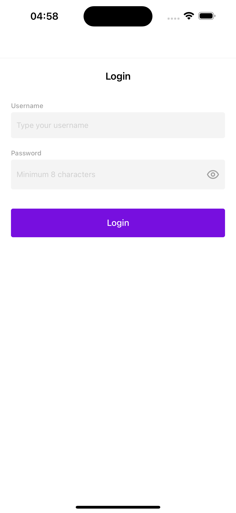
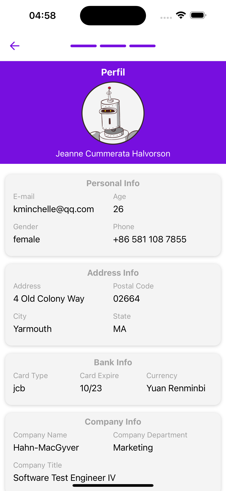

<h1 align="center">
    Dummyjson Auth
</h1>

<p align="center">
   <a href="https://github.com/msvictor">
    
  </a>
</p>

<p align="center">
  <a href="https://developer.mozilla.org/pt-BR/docs/Web/JavaScript">
    
  </a>
  <a href="https://www.typescriptlang.org/">
    
  </a>
  <a href="https://reactnative.dev/">
    
  </a>
  <a href="https://jestjs.io/pt-BR/">
    
  </a>
  <a href="https://styled-components.com/">
    
  </a>
  <a href="https://eslint.org/">
    
  </a>
    <a href="https://prettier.io/">
    
  </a>
    <a href="https://redux.js.org/">
    
  </a>
</p>

## Dummyjson Auth

- [Dummyjson Auth](#dummyjson-auth)
- [:interrobang: About](#interrobang-about)
- [:sparkles: The Application](#sparkles-the-application)
- [:diamonds: Techs](#diamonds-techs)
- [:octocat:Clone this repo](#octocatclone-this-repo)

<a id="about"></a>

## :interrobang: About

<strong>Dummyjson Auth:</strong> um aplicativo para se executar login e ver as informações do usuario

<a id="application"></a>

## :sparkles: The Application

<h3 align="center">
    
    
</h3>

<a id="techs"></a>

## :diamonds: Techs

The project was developed with the technologies below:

- [Javacript](https://developer.mozilla.org/pt-BR/docs/Web/JavaScript)
- [Typescript](https://www.typescriptlang.org/)
- [React Native](https://expo.io/)
- [Async Storage](https://react-native-async-storage.github.io/async-storage/docs/install/)
- [Axios](https://axios-http.com/docs/intro)
- [ESLint](https://eslint.org/)
- [Prettier](https://prettier.io/)
- [React Navigation](https://reactnavigation.org/)
- [React Native Config](https://github.com/luggit/react-native-config)
- [React Redux](https://redux.js.org/introduction/getting-started)
- [Redux Toolkit](https://redux-toolkit.js.org/introduction/getting-started)
- [Styled Components](https://styled-components.com/)

<a id="clone"></a>

## :octocat:Clone this repo

1. On command line terminal:

```sh
  git clone https://github.com/msvictor/dummyjson-auth.git
```

1. Go to folder:

```sh
  cd dummyjson-auth
```

3. Add the dependencies

```sh
  yarn
```

4. Run the app

```sh
  # on android device
  yarn android

  # on ios device
  yarn ios
```
